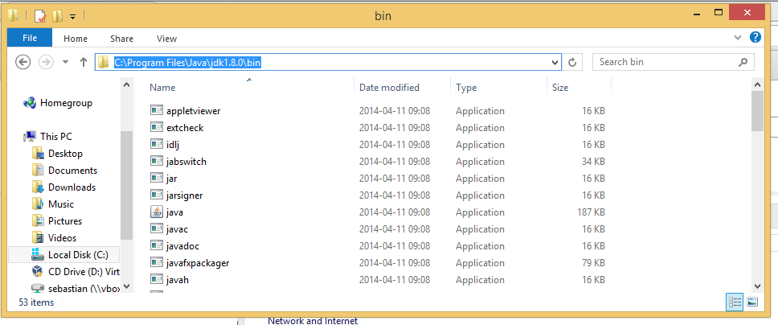
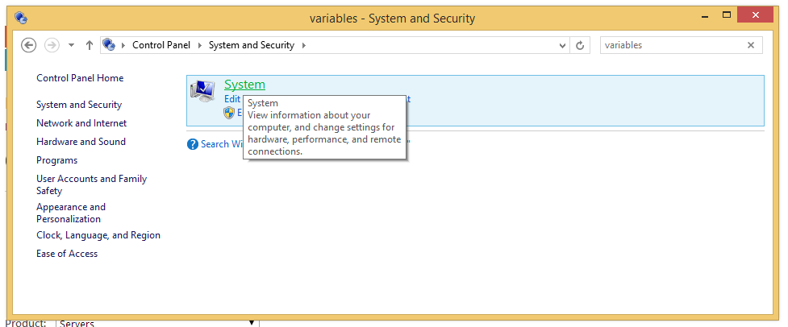
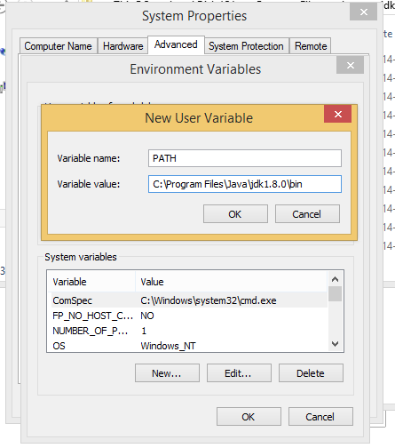
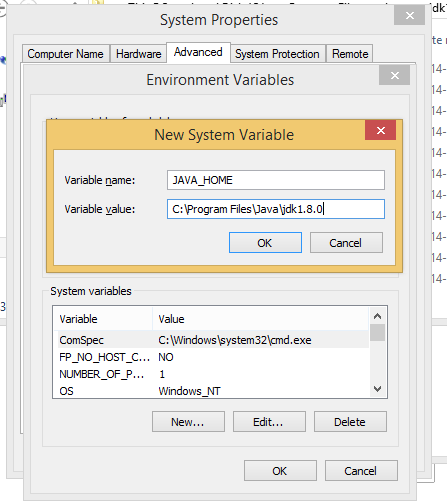
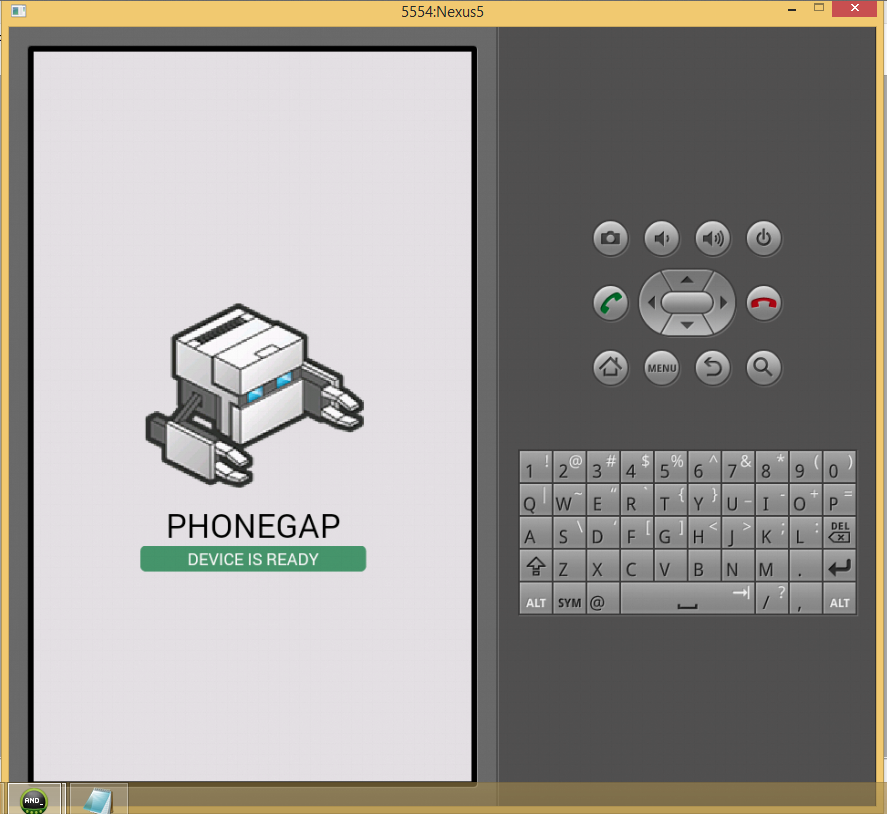

# PhoneGap installation on Windows

This guide will help you kickstart your PhoneGap development. It has been tested on Windows 8.1.

## Requirements

We will need to have the following components. The guide will help you to install them.

- [Java](http://java.oracle.com)
- [Apache Ant](http://ant.apache.org/)
- [NodeJS](http://nodejs.org/)
- [PhoneGap](http://www.phonegap.com)
- [Android Developer Tools](http://developer.android.com) (provides Android SDK and Eclipse)

## Installing Java

### Download

Download Java 1.8 JDK from [Oracle](http://www.oracle.com/technetwork/java/javase/downloads/index.html)

### Basic installation

Run the .exe file you downloaded and click next throughout the guide.

### Configure your `PATH` and `JAVA_HOME`

First off we need to find out where your JDK is installed.

- Open the file explorer
- Navigate to `C:\Program Files\Java\jdk1.8.0\bin`. This is the default location for the JDK, if you installed it elsewhere, go there instead.
- Copy the path from the file explorer

The next thing we need to do is to add Java to your system `PATH`.

- Open the **Control Panel**
- Search for `variables`
- Click **Edit the system environment variables**

- Click **Environment Variables**
- Under *User variables*, click **New** (or **Edit** if you already have a variable called `PATH`)
- If you are creating a new variable, write ``PATH`` in *Variable name*
- Add the path you copied above to the **Variable value** field. Separate multiple paths with a `;`.
- Click **OK**

- Under *System variables*, click **New** (or **Edit** if you already have a variable called `JAVA_HOME`)
- If you are creating a new variable, write ``JAVA_HOME`` in *Variable name*
- Add the path you copied previously to the *Variable value* field. BUT remove the trailing `\bin`. So the path in this example should be `C:\Program Files\Java\jdk1.8.0`. If you already have a value here, keep it and separate the paths using `;`
- Click **OK**

- Close all dialogues

## Installing Apache Ant

### Download

Download [Apache Ant](http://ant.apache.org/) from [http://ant.apache.org/bindownload.cgi]. You will want to download the `.zip` file.

Here's a direct link to the latest release as of 2014-04-11 [http://ant.apache.org/bindownload.cgi](http://ant.apache.org/bindownload.cgi)

### Extract

Ant is distributed in a zip file. Extract the zip file to `C:\Program Files\Apache`.

### Add ant to your `PATH`

- Open the **Control Panel**
- Search for `variables`
- Click **Edit the system environment variables**
- Click **Environment Variables**
- Under *User variables*, click **New** (or **Edit** if you already have a variable called `PATH`)
- If you are creating a new variable, write ``PATH`` in *Variable name*
- Add `C:\Program Files\Apache\apache-ant-1.9.3\bin` to the **Variable value** field. Separate multiple paths with a `;`. Also remember to change the version number in the path as needed.
- Click **OK**

## Installing Android Developer Tools (ADT)

### Download

Download ADT from [developer.android.com](http://developer.android.com/sdk/index.html)

### Extract ADT

The ADT is a zip file. Extract it to `C:\ADT`.

### Add the Android SDK to your `PATH`

We need to find the path to your Android SDK. Open the Windows Explorer and go to your equivalent to `C:\ADT\adt-bundle-windows-x86_64-20140321\sdk`. The version number in the middle might be different for you. Copy the path.

- Open the **Control Panel**
- Search for `variables`
- Click **Edit the system environment variables**
- Click **Environment Variables**
- Under *User variables*, click **New** (or **Edit** if you already have a variable called `PATH`)
- If you are creating a new variable, write ``PATH`` in *Variable name*
- Add `C:\ADT\adt-bundle-windows-x86_64-20140321\platform-tools` to the **Variable value** field. Separate multiple paths with a `;`.
- Add `C:\ADT\adt-bundle-windows-x86_64-20140321\tools` to the **Variable value** field. Separate multiple paths with a `;`.
- Click **OK**

## Install NodeJS

### Download

Surf to [NodeJS](http://nodejs.org/) and download the installation package.

### Installation

Run the `.msi` file you downloaded and simply follow the guide. You can just click **Next** throughout the guide.

## Install PhoneGap

### Installation

Open Windows PowerShell and run:

    npm install -g phonegap

## Create a Android Virtual Device (AVD)

We are about to create a virtual Android system (AVD) on your computer. To start with we should find an Android target. Run the following

    android list target

You will see a list of all available targets on your system. I will be using `android-19`.

Next step is to create an AVD. Run this command

    android create avd --name Nexus5 --target android-19

## Write your first PhoneGap project

### Initialize the project directory

We will now initialize the PhoneGap project.

    phonegap create TeacherFinder
    cd TeacherFinder

This will start a new PhoneGap project with the initial file structure.

### Start the Android emulator

You should now start the Android emulator. This might take some time the first time you do it, as PhoneGap will download requirements. Make sure that you are in the `TeacherFinder` folder.

    phonegap run android

